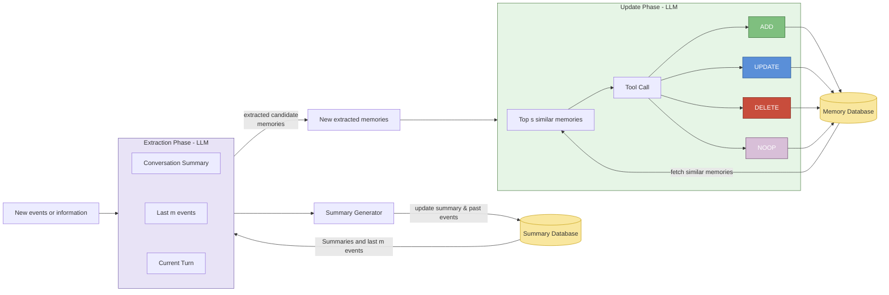

# Memory Extraction & Update Flow with CosmosDB

Legend:
- Events enter the Extraction Phase combining prior summary, last m events, and current turn.
- Summary Generator retrieves existing summary & past events from the Summary Database and can refresh the summary provided to the Extraction Phase.
- Extraction Phase emits candidate (new extracted) memories.
- Update Phase pulls top similar memories from the Memory Database, decides per candidate whether to ADD, UPDATE, DELETE, or NOOP, producing new memory states.
- Memory Database is then updated with resulting memory operations.

