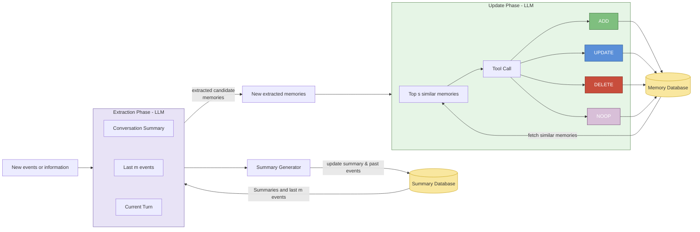
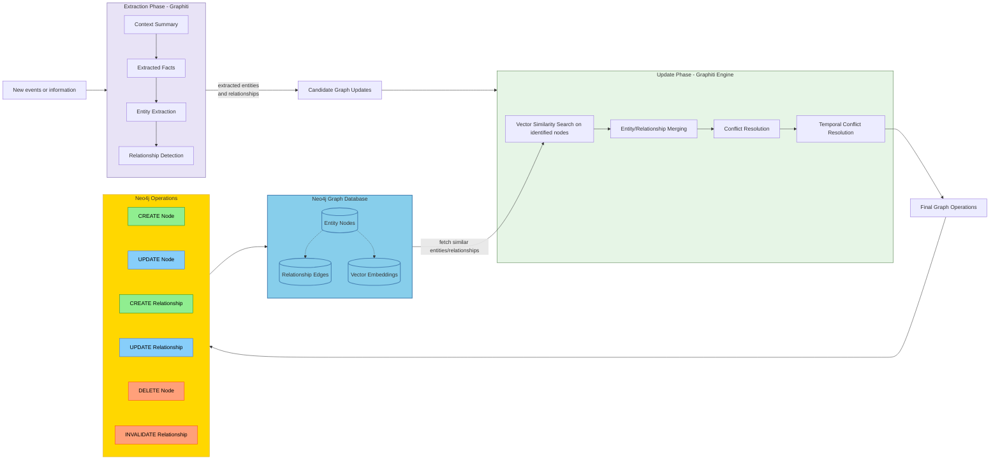
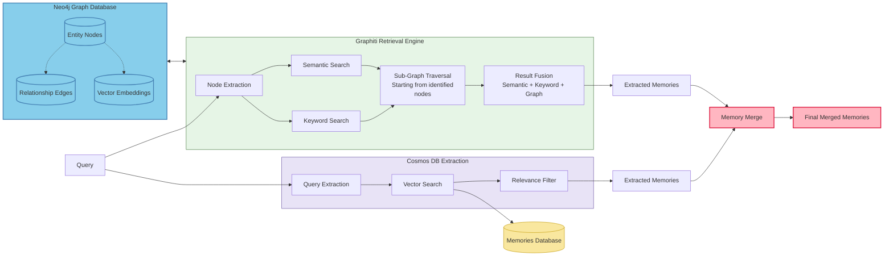

# Memory Extraction & Update Flow with CosmosDB

Legend:
- Events enter the Extraction Phase combining prior summary, last m events, and current turn.
- Summary Generator retrieves existing summary & past events from the Summary Database and can refresh the summary provided to the Extraction Phase.
- Extraction Phase emits candidate (new extracted) memories.
- Update Phase pulls top similar memories from the Memory Database, decides per candidate whether to ADD, UPDATE, DELETE, or NOOP, producing new memory states.
- Memory Database is then updated with resulting memory operations.

## Graphiti with Neo4j Internal Memory Update Flow

Graphiti-Neo4j Legend:

- Events are processed by Graphiti's extraction phase to identify entities, relationships, facts, and temporal context
- Temporal resolution ensures proper time-based ordering and conflict detection
- Vector similarity search finds existing similar entities and relationships in Neo4j
- Graphiti's merging engine resolves conflicts and determines optimal graph structure with temporal awareness
- Temporal conflict resolution handles time-based inconsistencies and updates
- Final operations are executed as Cypher queries against the Neo4j graph database
- Neo4j stores entities as nodes, relationships as edges, and maintains vector embeddings for similarity search

## Hybrid Retrieval Flow (Semantic + BM25 + Graph Traversal)

